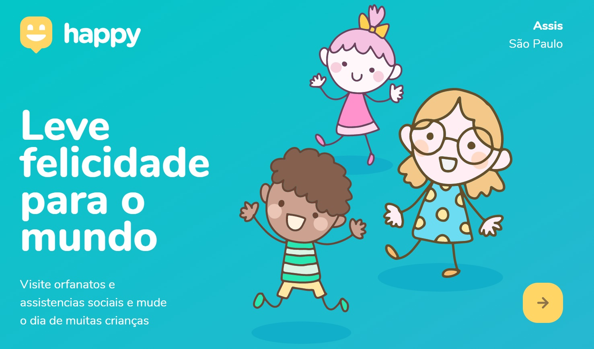
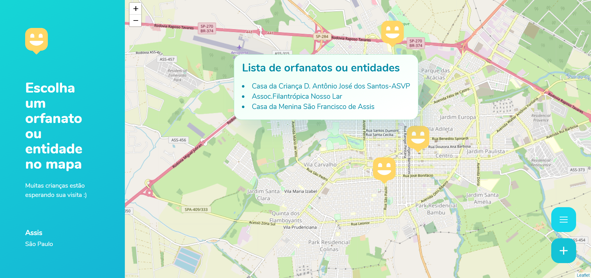

# HappyNLW
Repositório para estudos referente 3ª edição da Next Level Week. O Happy é um projeto que visa facilitar visitas aos orfanatos próximos a você
O projeto foi realizado durante os dias 12 a 18 de Outubro de 2020.

    
     1 Tela Inicial. 

   
   
 2 Esta tela apresenta um mapa e marcações de locais que possuem orfantatos e entidades assistenciais a crianças carentes.
   Abaixo temos a opção de listar locais já cadastrados e cadastrar novos locais.
    

 

   
